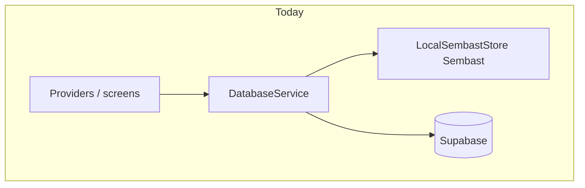

# Local persistence migration plan: Sembast → Drift (SQLite)

This document is a **full migration roadmap** with a **clear default path**, scoped to [Huddle / LoboHub](README.md): one canonical [`AppDB`](lib/models/models.dart) snapshot, [`DatabaseService`](lib/services/database_service.dart) merge/sync, and [`LocalSembastStore`](lib/services/local_sembast_store.dart) persistence.

It does **not** replace Supabase or change server schema by itself; it changes **how** `AppDB`, tombstones, sync cursors, and the outbox are stored locally.

---

## 1. Executive summary

| Item | Recommendation |
|------|----------------|
| **Should we migrate “because the app might get big”?** | No—migrate when **measurements** or **product needs** justify cost (§3). |
| **Default technical strategy** | **Strangler migration**: introduce a **`LocalPersistenceStore` abstraction**, ship a **Drift “blob mirror”** of today’s shards first (§6.2), then **optionally** normalize hot domains later (§6.3). |
| **Risk level** | **High**—local DB touches login, offline, merge, wipe, web IndexedDB vs native files. Mitigate with flags, dual-write validation, and rollback (§9–§11). |

---

## 2. Goals and non-goals

### Goals

- Replace Sembast as the **long-term** local primitive with **Drift + SQLite** (mobile/desktop) and a **supported web strategy** (§8).
- Preserve behavior of **`saveLocal`**, **tombstones**, **sync cursors**, **outbox**, **`reconcileCloud`**, **`syncToCloud`** without semantic regressions.
- Support **one-shot migration** from existing installs (§7).

### Non-goals (initial phases)

- Redesigning cloud sync semantics (incremental cursors, merge rules, `SyncEchoTracker`) unless measurement proves storage was the bottleneck.
- Normalizing **all** `AppDB` entities into relational tables in phase one—that is an optional later epic (§6.3).

---

## 3. Migration gates (decision checkpoints)

Proceed past **Gate G1** only when at least one is true:

1. **Performance**: Cold start or `saveLocal` blocks UI / blows memory budgets on representative families (large `AppDB`).
2. **Product**: You need **indexed partial reads** (e.g. load tasks-only without hydrating entire graph).
3. **Operational**: Sembast/web IndexedDB limits or corruption reports exceed tolerance.

Until then, prefer **sync correctness work** (persist ordering, scope, telemetry—already tracked separately) over a storage migration.

**Gate G2** (before removing Sembast): dual-write or checksum validation passes on dogfood builds for **≥ N sessions per platform** without drift in tombstones/cursors/outbox.

---

## 4. Current architecture (baseline)

Today:

- [`LocalSembastStore`](lib/services/local_sembast_store.dart) persists `AppDB` by **sharding** [`AppDB.toJson()`](lib/models/models.dart) keys into separate Sembast records (not one giant string).
- Additional Sembast records: **tombstones**, **`familyId:table` sync cursors**, **outbox** payloads.
- [`DatabaseService`](lib/services/database_service.dart) owns `_cache`, tombstone hydration, cursor persistence, `saveLocal`, `reconcileCloud`, `syncToCloud`.

**Constraints to preserve:**

- [`DatabaseService.wipeAllLocalStorage`](lib/services/database_service.dart) deletes physical DB + clears prefs—replacement must expose equivalent **destructive wipe**.
- Web uses conditional [`local_db_factory`](lib/services/local_db_factory.dart)—Drift web setup must be explicitly validated (bundle size, WASM sqlite, persistence behavior).

---

## 5. Target architecture (two tiers)

### Tier A — Blob-first Drift (recommended first milestone)

Mirror today’s layout in SQLite:

- Table `appdb_shard(key TEXT PRIMARY KEY, json TEXT)` — one row per top-level `AppDB` JSON key (same shard keys as Sembast today).
- Table `kv_store(key TEXT PRIMARY KEY, json TEXT)` for tombstones list, cursors map, outbox list—or separate typed tables if you prefer.

**Why Tier A first**

- Minimal change to **`AppDB`**, **`fromJson`/`toJson`**, **`_mergeWithCloud`**, providers.
- Proves Drift wiring, migrations, platform matrix, backup/wipe—**before** rewriting domain layers.

### Tier B — Normalized Drift (optional later epic)

Introduce tables per domain (`tasks`, `family_members`, …) generated from drift schemas; **`AppDB`** becomes a façade or is eliminated gradually.

**Why defer Tier B**

- Very large surface area ([`CloudSyncScope`](lib/config/cloud_sync_scope.dart), dozens of modules).
- Highest regression risk; only justified after Tier A is stable **and** Tier B solves measurable pain.

---

## 6. Recommended path (phased)

### Phase 0 — Instrumentation and baseline (1–2 weeks calendar, part-time)

**Deliverables**

- Metrics: **time** for `LocalSembastStore.readAppDb` / `writeAppDb`, peak RSS after load, reconcile duration (already partly aided by `[CloudSync]` logs in [`SyncProvider`](lib/providers/sync_provider.dart)).
- Document worst-case **`AppDB`** sizes from staging/realistic fixtures.

**Exit**: Gate **G1** evidence deck or explicit decision to postpone migration.

---

### Phase 1 — Abstraction seam (1–2 weeks)

**Deliverables**

- New interface, e.g. `abstract class LocalPersistenceStore` with methods aligned to today’s operations:

  - `Future<AppDB> readAppDb()`
  - `Future<void> writeAppDb(AppDB db)`
  - Tombstones: read/write `Set<String>` or opaque blob
  - Cursors: read/write `Map<String, String>`
  - Outbox: read/write `List<Map<String, dynamic>>`
  - `Future<bool> hasStoredAppDb()`
  - `Future<void> clearAppRecords()`
  - `Future<void> deletePhysicalDatabase()`

- **`SembastLocalStore`** implements `LocalPersistenceStore` by delegating to existing [`LocalSembastStore`](lib/services/local_sembast_store.dart) (thin wrapper).

- [`DatabaseService`](lib/services/database_service.dart) depends on **`LocalPersistenceStore`** via static injection or service locator **behind a compile-time / runtime flag** (default Sembast).

**Exit**: No behavior change in production default; tests or debug builds can flip implementation.

---

### Phase 2 — Drift Tier A implementation (2–4 weeks)

**Deliverables**

- Add **`drift`** + **`drift_flutter`** (and **`sqlite3_flutter_libs`** on IO) dependencies; configure **`build_runner`** for codegen.
- **`DriftBlobLocalStore`** implementing `LocalPersistenceStore`:

  - Drift schema **version 1** matching §5 Tier A.
  - **Drift migrations**: empty → v1 creates tables.

- **Development flag**: `--dart-define=LOCAL_STORE=drift` or in-app hidden toggle **debug-only**.

- **Golden tests**: round-trip `AppDB.empty()` → sample populated DB → `readAppDb` equals input for representative fixtures.

**Exit**: Manual QA on Android/iOS/desktop debug with drift flag; web spike outcome documented (§8).

---

### Phase 3 — Online migration from Sembast → Drift (1–2 weeks)

**Deliverables**

- On startup (once per install), if Sembast marker exists and Drift empty:

  1. Read full `AppDB` + tombstones + cursors + outbox from Sembast.
  2. Write into Drift in **one transaction**.
  3. Optionally **verify** checksum (hash of canonical JSON or per-shard hashes).
  4. Only then **delete Sembast marker / records** or rename DB file—never brick Sembast until Drift commit succeeds.

- Feature flag **`migrate_local_store_v1`** default off until validated.

**Exit**: Successful migration on dogfood accounts; rollback path verified (§9).

---

### Phase 4 — Dual-write / shadow validation (optional but strongly recommended, 1–2 weeks)

**Deliverables**

- In beta builds only: **write both** Sembast + Drift; compare reads on next launch or assert checksum after write (performance cost acceptable in beta).

**Exit**: Gate **G2** satisfied.

---

### Phase 5 — Cutover and Sembast removal (1 week + stabilization)

**Deliverables**

- Default **`LocalPersistenceStore`** = Drift.
- Keep Sembast dependency **one release** behind a `#ifdef` / conditional import fallback if migration fails at runtime—read Sembast backup path once.

- Remove [`LocalSembastStore`](lib/services/local_sembast_store.dart) and Sembast deps when crash-free metrics OK.

**Exit**: Smaller dependency tree; single persistence implementation.

---

### Phase 6 — Tier B normalization (optional separate epic)

Only after Phase 5 is stable.

**Deliverables**

- Per-domain tables; incremental loaders; refactor hotspots away from full-graph mutation where justified.

---

## 7. Data migration algorithm (precise)

**Preconditions**

- App version ≥ migration-aware build.
- Sembast [`hasStoredAppDb`](lib/services/local_sembast_store.dart) is true.

**Steps**

1. Open Drift DB (create if missing).
2. Begin transaction **T**.
3. Read from Sembast: full shards → assemble `AppDB.fromJson(map)` identical to today.
4. Read tombstones / cursors / outbox raw payloads.
5. Write Drift Tier A representation inside **T**.
6. Commit **T**.
7. If commit OK: delete Sembast app records via existing `clearAppRecords()` **or** delete physical Sembast DB after verifying Drift read-back.
8. If any failure: **abort**, leave Sembast authoritative; surface non-fatal analytics.

**Never** partially delete Sembast before Drift commit succeeds.

---

## 8. Platform matrix

| Platform | Sembast today | Drift approach |
|----------|---------------|----------------|
| Android / iOS | File via path_provider | sqlite via drift_flutter — standard |
| Desktop (if shipped) | Same | sqlite file |
| **Web** | IndexedDB (`kIsWeb` branch in [`LocalSembastStore`](lib/services/local_sembast_store.dart)) | Drift **WebAssembly SQLite** — validate bundle impact, persistence across reloads, private mode |

**Web spike** is a **hard prerequisite** before promising Sembast removal on web.

---

## 9. Rollback strategy

1. **During Phase 3–4**: feature flag disables Drift reads; Sembast remains source of truth.
2. **Post-cutover**: ship **one version** that can detect empty Drift + orphaned Sembast backup file (copy Sembast DB path to `.bak` before wipe—optional).
3. **Worst case**: user clears site data / reinstall—acceptable only if documented and rare.

---

## 10. Testing matrix

| Layer | Cases |
|-------|--------|
| Unit | `LocalPersistenceStore` round-trip; migration idempotency (running twice does not duplicate); wipe clears all tables |
| Integration | Login → edit → kill app → cold start → data intact (both stores during dual-write) |
| Sync | `reconcileCloud` after migration produces identical merged snapshot vs control Sembast-only device |
| Web | Private window, refresh, multi-tab behavior documented |

---

## 11. Risk register

| Risk | Mitigation |
|------|------------|
| Silent data loss on migration | Transactional migrate; checksum; beta dual-write |
| Web SQLite quirks | Early spike; possibly **stay Sembast on web only** temporarily (split backend—not ideal but viable bridge) |
| Long migrations block startup | Show splash/progress; migrate in isolate where safe |
| Tombstone/cursor skew | Migrate **all three** auxiliary payloads atomically with `AppDB` |
| Team velocity drag | Tier A first; defer Tier B |

---

## 12. Ownership and sequencing calendar (indicative)

Rough wall-clock assuming one senior Flutter engineer part-time alongside features:

| Phase | Duration |
|-------|----------|
| 0 Baseline | 1–2 weeks |
| 1 Abstraction | 1–2 weeks |
| 2 Drift Tier A | 2–4 weeks |
| 3 Online migrate | 1–2 weeks |
| 4 Dual-write beta | 1–2 weeks |
| 5 Cutover | ~1 week + soak |

Tier B: **months**, parallelizable by domain.

---

## 13. File inventory (expected touch points)

Implementation will primarily involve:

- [`lib/services/database_service.dart`](lib/services/database_service.dart)
- [`lib/services/local_sembast_store.dart`](lib/services/local_sembast_store.dart) (replacement / deprecation)
- [`lib/services/sync_outbox.dart`](lib/services/sync_outbox.dart) (only if persistence API changes)
- [`lib/providers/data_provider.dart`](lib/providers/data_provider.dart) — unchanged ideally if `DatabaseService` stays the façade
- New: `lib/services/local_store/local_persistence_store.dart`, `lib/services/local_store/drift_local_store.dart`, `lib/services/local_store/migration_runner.dart`
- `pubspec.yaml`, generated `*.drift.dart` files
- CI: add `dart run build_runner build --delete-conflicting-outputs` where appropriate

---

## 14. Related docs

- Sync debugging checklist: [`docs/sync-repro-matrix.md`](sync-repro-matrix.md)
- Push scope patterns: [`docs/sync-scope-audit.md`](sync-scope-audit.md)

---

## 15. Summary path (TL;DR checklist)

1. **Measure** cold load / save cost → satisfy Gate **G1** or stop.
2. **`LocalPersistenceStore`** + Sembast adapter (**no behavior change**).
3. **Drift Tier A** blob schema behind flag.
4. **Transactional online migration** Sembast → Drift.
5. **Beta dual-write** validation → Gate **G2**.
6. **Cutover**, soak, **delete Sembast**.
7. _(Optional)_ **Tier B** normalization epic.

This sequence minimizes time spent with **two sources of truth** in production while keeping a **clean rollback story**.

---

## 16. Implementation status in this repo (done)

Tier A (**blob mirror**) plus bootstrap is implemented:

| Piece | Location |
|-------|-----------|
| `LocalPersistenceStore` + resolver singleton | [`lib/services/local_store/local_persistence_store.dart`](lib/services/local_store/local_persistence_store.dart), [`local_store_resolver.dart`](lib/services/local_store/local_store_resolver.dart) |
| Web / WASM | [`local_store_bootstrap_stub.dart`](lib/services/local_store/local_store_bootstrap_stub.dart) stays on **Sembast** (IndexedDB). |
| Native Drift DB + shards / KV tables | [`huddle_drift_database.dart`](lib/services/local_store/huddle_drift_database.dart) (+ generated `huddle_drift_database.g.dart`) |
| Drift Tier A backing | [`drift_blob_local_store.dart`](lib/services/local_store/drift_blob_local_store.dart) |
| One-shot Sembast → Drift migrate + Sembast wipe | [`local_store_bootstrap_io.dart`](lib/services/local_store/local_store_bootstrap_io.dart), `migrateSembastToDriftOrThrow` |
| Wired into app | [`database_service.dart`](../lib/services/database_service.dart), [`sync_outbox.dart`](../lib/services/sync_outbox.dart) |

**Flags**

- **`--dart-define=LOCAL_STORE=sembast`** (native): keep Sembast only (escape hatch).
- Web: always Sembast via conditional import until a WASM SQLite path is added.

**Codegen:** after editing `huddle_drift_database.dart`:

`dart run build_runner build --delete-conflicting-outputs`
